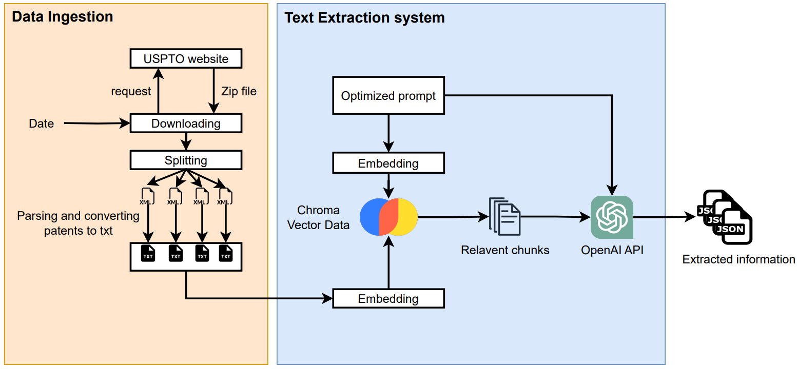

# PatentGPT

This repository hosts a prototype for patent analysis with a particular focus on extracting specific technical measurements and their associated values

## Quick Start

1. Clone this repository.
2. Install the required Python packages by running `!pip install -r requirements.txt`.
3. Run the Jupyter notebook `quick_start.ipynb`.
4. Authenticate and add your OpenAI token. Then answer these questions::
   - Enter a date in the format 'YYYY-MM-DD': exampe is 2023-01-12
   - Enter the number of patents you want to analyze: example is 5 (this randomly select 5 parsed patents)
   - Do you want to log the results? (yes/no)
   - Select a model for analysis: 1. gpt-3.5-turbo 2. gpt-4
5. JSON results will be saved in the output folder.

## System Design

Below is an image that illustrates the main design and workflow of the patent analysis system

The project involves the following steps:

1. Downloading a ZIP archive that contains granted patent full-text data (without images) from https://bulkdata.uspto.gov/.
2. Reading the contained patents from XML files and extracting individual XML file, parsing it to text file and saving it in data.
3. Implementing an approach based on a large language model (LLM) to extract measurements from the patents using vector store Chroma. The measurements are returned in a structured format (such as JSON).
4. Analyzing the model's results, and discussing the results/output of the models, including typical errors and points for improvement.

## Directory Structure

- root/
  - data/
  - output/
  - src/
  - requirements.txt
  - LICENSE
  - README.md
  - images

## Requirements

- Python 3.10+
- See requirements.txt for Python packages and versions.

## License

This project is licensed under the terms of the MIT license. See [LICENSE](LICENSE) file.

## Additional Resources

For further questions or if you encounter any problems, please do not hesitate to open an issue.

- [My Website](https://arminnorouzi.github.io/) - More details about me and my projects.
- [LinkedIn](https://www.linkedin.com/in/arminnorouzi/) - See the post related to machine learning and software development on LinkedIn.
- [Medium](https://arminnorouzi.medium.com/) - See my posts related to ML/AI, algorithms, and system design.
